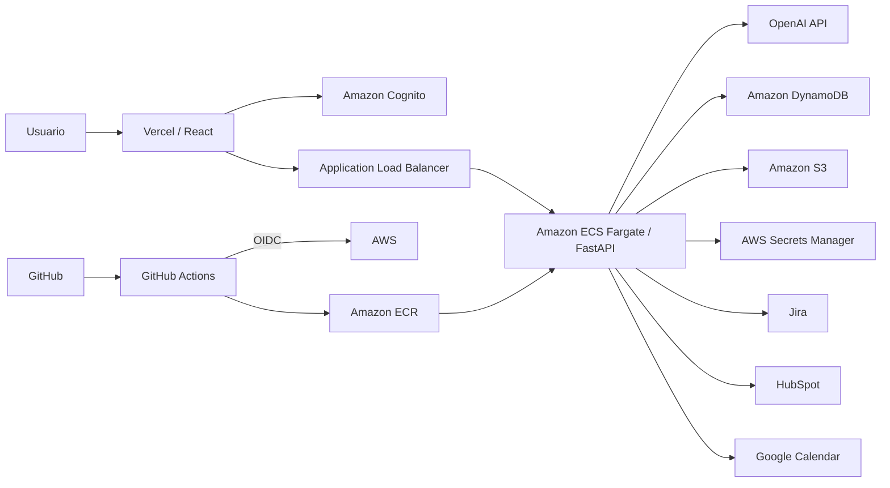

# UTP Assistant

UTP Assistant es una aplicación web orientada a la automatización de solicitudes empresariales mediante inteligencia artificial.

La plataforma integra un asistente conversacional con procesamiento de documentos, transcripción de audio, historial persistente, autenticación y ejecución de acciones sobre servicios externos como Jira, HubSpot y Google Calendar.

El proyecto combina un frontend desarrollado en React con un backend FastAPI desplegado sobre AWS.

## Características principales

- Asistente conversacional con OpenAI.
- Historial persistente de conversaciones.
- Carga y procesamiento de documentos PDF, DOCX y TXT.
- Almacenamiento privado de documentos en Amazon S3.
- Transcripción de audio.
- Transcripción en tiempo real.
- Integración con Jira.
- Integración con HubSpot.
- Integración con Google Calendar.
- Dashboard de métricas y actividad.
- Autenticación mediante Amazon Cognito.
- Auditoría de solicitudes.
- Límites de uso por usuario y globales.
- Gestión segura de credenciales mediante AWS Secrets Manager.
- CI/CD mediante GitHub Actions y OpenID Connect.
- Despliegue del frontend mediante Vercel.
- Despliegue del backend mediante Amazon ECS Fargate.

## Arquitectura



## Stack tecnológico

| Área | Tecnologías |
|---|---|
| Frontend | React 19, TypeScript, Vite, Mantine |
| Estado y datos | TanStack Query, Zustand |
| Backend | Python, FastAPI |
| Inteligencia artificial | OpenAI API |
| Autenticación | Amazon Cognito |
| Contenedores | Docker |
| Compute | Amazon ECS Fargate |
| Registro de imágenes | Amazon ECR |
| Base de datos | Amazon DynamoDB |
| Almacenamiento | Amazon S3 |
| Gestión de secretos | AWS Secrets Manager |
| Infraestructura | AWS SAM / CloudFormation |
| CI/CD | GitHub Actions + AWS OIDC |
| Hosting frontend | Vercel |

## Estructura del repositorio

```text
.
├── .github/
│   └── workflows/
│       ├── ci.yml
│       └── deploy.yml
│
├── backend/
│   └── api/
│       ├── app/
│       │   ├── ai/
│       │   ├── api/
│       │   ├── core/
│       │   ├── schemas/
│       │   └── services/
│       ├── tests/
│       ├── Dockerfile
│       ├── requirements.txt
│       └── requirements-dev.txt
│
├── frontend/
│   ├── public/
│   ├── src/
│   ├── package.json
│   └── vercel.json
│
├── infrastructure/
│   └── template.yaml
│
├── samconfig.toml
└── README.md
```

## Seguridad

El proyecto fue diseñado evitando almacenar credenciales sensibles directamente en el repositorio.

Las principales medidas implementadas son:

- Credenciales de servicios externos almacenadas en AWS Secrets Manager.
- Despliegues hacia AWS mediante GitHub Actions y OpenID Connect (OIDC), evitando access keys permanentes en GitHub.
- Autenticación de usuarios mediante Amazon Cognito.
- Validación de access tokens en el backend.
- Amazon S3 configurado con acceso público bloqueado.
- URLs prefirmadas de duración limitada para carga y descarga de documentos.
- Separación de configuración pública y secretos.
- Auditoría de solicitudes procesadas por el backend.
- Límites de uso por usuario y límites globales para controlar el consumo de servicios de IA.

## Control de uso

UTP Assistant implementa cuotas para evitar consumo excesivo o accidental de los servicios asociados a inteligencia artificial.

| Recurso | Límite por usuario / día | Límite global / día |
|---|---:|---:|
| Asistente IA | 20 | 60 |
| Audio | 5 | 15 |
| Realtime | 2 | 6 |

También se aplican límites por minuto para reducir abuso mediante solicitudes consecutivas.

Los contadores de uso se almacenan en Amazon DynamoDB y emplean TTL para eliminar automáticamente los registros temporales.

Las respuestas generadas por el asistente también tienen un límite máximo de tokens de salida.

## Ejecución local

### Backend

Ubicarse en el directorio del backend:

```bash
cd backend/api
```

Crear un entorno virtual:

```bash
python -m venv .venv
```

En Windows:

```powershell
.venv\Scripts\Activate.ps1
```

Instalar las dependencias:

```bash
pip install -r requirements.txt
```

Para desarrollo y pruebas:

```bash
pip install -r requirements-dev.txt
```

Ejecutar la API:

```bash
uvicorn app.main:app --reload
```

Por defecto, FastAPI estará disponible en:

```text
http://localhost:8000
```

Health check:

```text
GET http://localhost:8000/api/health
```

Documentación interactiva de FastAPI:

```text
http://localhost:8000/docs
```

### Frontend

Ubicarse en el directorio del frontend:

```bash
cd frontend
```

Instalar las dependencias:

```bash
npm ci
```

Crear el archivo local de variables de entorno a partir de:

```text
frontend/.env.example
```

Variables utilizadas:

```env
VITE_API_BASE_URL=http://localhost:8000/api
VITE_AWS_REGION=us-east-1
VITE_COGNITO_USER_POOL_ID=us-east-1_example
VITE_COGNITO_CLIENT_ID=example-client-id
```

Después ejecutar:

```bash
npm run dev
```

El frontend estará disponible normalmente en:

```text
http://localhost:5173
```

## Tests

El backend utiliza `pytest` para ejecutar pruebas automatizadas.

Desde:

```bash
cd backend/api
```

ejecutar:

```bash
python -m pytest -q
```

Actualmente se validan aspectos básicos y críticos de la aplicación:

- Disponibilidad del health check.
- Protección de endpoints que requieren autenticación.
- Límites diarios configurados para cada recurso.
- Inclusión del contador global dentro de las transacciones de uso.

Para validar el frontend:

```bash
cd frontend

npm run lint
npm run build
```

## Integración continua

El repositorio incluye un workflow de GitHub Actions para validar automáticamente los cambios.

El pipeline de CI ejecuta:

1. Instalación de dependencias del backend.
2. Tests automatizados con `pytest`.
3. Instalación de dependencias del frontend.
4. Validación mediante ESLint.
5. Build de producción con Vite.

Esto permite detectar errores antes de desplegar nuevas versiones.

## Despliegue continuo del backend

El backend cuenta con un pipeline automatizado hacia Amazon ECS.

Cuando se envían cambios relevantes a `main`:

```text
GitHub
   │
   ▼
GitHub Actions
   │
   ├── Tests
   │
   ▼
AWS OIDC
   │
   ▼
Docker Build
   │
   ▼
Amazon ECR
   │
   ▼
Nueva ECS Task Definition
   │
   ▼
Amazon ECS Fargate
```

El proceso realiza:

1. Checkout del repositorio.
2. Instalación de dependencias.
3. Ejecución de los tests.
4. Autenticación temporal con AWS mediante OIDC.
5. Construcción de la imagen Docker.
6. Publicación de la imagen en Amazon ECR.
7. Registro de una nueva revisión de la Task Definition.
8. Actualización del servicio ECS.
9. Espera hasta que el servicio alcance un estado estable.

Si los tests fallan, las etapas de autenticación, publicación y despliegue no continúan.

## Despliegue del frontend

El frontend está conectado con Vercel y puede desplegarse automáticamente a partir de los cambios enviados a la rama principal.

Vercel ejecuta el build de producción del proyecto Vite y publica los archivos generados en `dist`.

## Servicios AWS utilizados

El proyecto utiliza distintos servicios de AWS con responsabilidades separadas:

- **Amazon Cognito:** autenticación de usuarios.
- **Amazon ECS Fargate:** ejecución del backend.
- **Amazon ECR:** almacenamiento de imágenes Docker.
- **Amazon DynamoDB:** conversaciones, auditoría y cuotas de uso.
- **Amazon S3:** almacenamiento privado de documentos.
- **AWS Secrets Manager:** almacenamiento de credenciales externas.
- **Application Load Balancer:** acceso al servicio backend.
- **AWS IAM:** permisos de los recursos y despliegues.
- **AWS CloudFormation / SAM:** definición de infraestructura.

## Integraciones externas

El asistente puede interactuar con diferentes servicios externos según la solicitud procesada:

- OpenAI
- Jira
- HubSpot
- Google Calendar

Las credenciales necesarias para estas integraciones se mantienen fuera del código fuente.

## Estado del proyecto

El proyecto cuenta actualmente con:

- Frontend desplegado.
- Backend contenerizado.
- Backend desplegado en ECS Fargate.
- Autenticación con Cognito.
- Procesamiento de documentos.
- Historial persistente.
- Transcripción de audio.
- Transcripción en tiempo real.
- Integraciones externas.
- Auditoría.
- Dashboard de actividad y consumo.
- Límites de uso individuales y globales.
- Tests automatizados.
- Pipeline de integración continua.
- Pipeline de despliegue continuo.

## Propósito

UTP Assistant fue desarrollado con fines académicos y demostrativos para aplicar conceptos relacionados con:

- Desarrollo frontend y backend.
- Integración de inteligencia artificial.
- Arquitectura cloud.
- Servicios administrados de AWS.
- Seguridad y gestión de secretos.
- Contenedores.
- Integración continua.
- Despliegue continuo.
- Automatización e integración con APIs externas.

La configuración actual está orientada a pruebas y demostraciones con un número controlado de usuarios.

## Autor

**ItsZuro**

Proyecto académico y demostrativo de integración de inteligencia artificial, desarrollo web, servicios cloud y automatización empresarial.